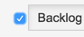

# jiraMonkey

Client-side hacks for tweaking life with JIRA

The comments in the top of each file, and hopefully the filenames, tell you what the files do.

I welcome comments and pull requests.

This script is tested using Chrome browser.

# Getting Started 
_(Thanks to Nariman Riahi for contributing this guide)_

## Get TamperMonkey

Firefox users can use GreaseMonkey, but these instructions won't be exactly right.

Install TamperMonkey Chrome extension from Google Webstore. <https://chrome.google.com/webstore/search/tampermonkey?_category=extensions>
Now in Chrome toolbar you should see the TamperMonkey icon. 
Before you add scripts, you have to enable "Allow access to file URLs" in TamperMonkey setting. Here is how:

Go to Chrome Preferences and click on Extensions
Find TamperMonkey and check the box "Allow access to file URLs".
Now you are ready to add your script to TamperMonkey.

## Add jiraMonkey to TamperMonkey:

Click the TamperMonkey toolbar icon.
Select "Add a New Script". Now you are in TamperMonkey Editor.
Delete the default entries and paste this entire script and click the save icon.
You are done.

## How to use the script:

Go to an Agile board in JIRA and you should see the TamperMonkey icon change to show one active script. 

Look to the left of the Backlog button and you should see a checkbox.  Check this checkbox. 

Now click on any JIRA ticket in the list and you see that the detail view doesn't open (or at least, doesn't stay open. On some installations, the detail view opens but closes immediately.)

